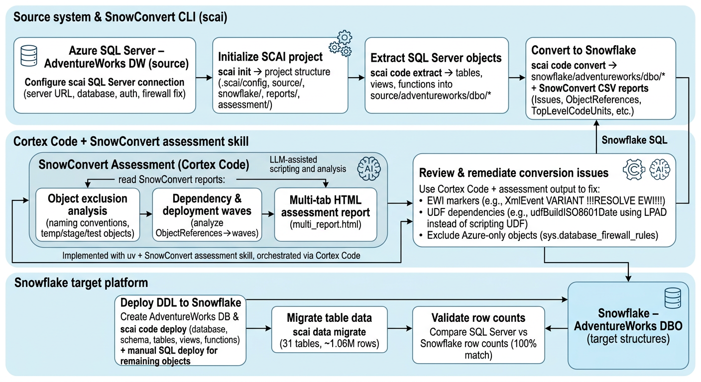
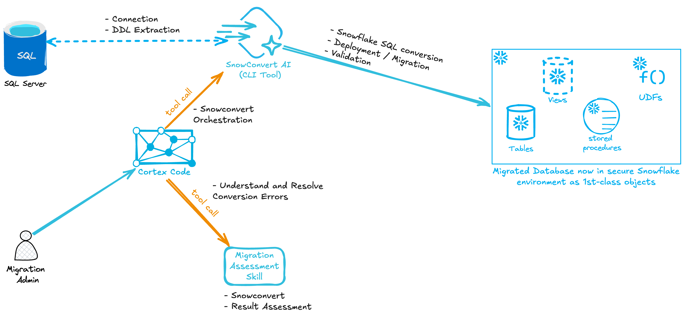

# SQL Server to Snowflake Migration: AdventureWorks DW

End-to-end migration of the AdventureWorks Data Warehouse from Azure SQL Server to Snowflake using the SnowConvert AI CLI (`scai`).

## Source Environment

| Property | Value |
|---|---|
| Platform | Azure SQL Server |
| Server | `snowconvert-datamigration.database.windows.net` |
| Database | `AdventureWorks` |
| Port | 1433 |
| Authentication | Standard (username/password) |
| Credentials file | `.sqlserver_creds` |

## Target Environment

| Property | Value |
|---|---|
| Platform | Snowflake |
| Connection | `AWS_DEMO_1` |
| Database | `ADVENTUREWORKS` |
| Schema | `DBO` |
| Role | `SYSADMIN` |
| Warehouse | `COMPUTE_WH` |

## Migration Summary

| Metric | Value |
|---|---|
| Objects extracted | 42 (31 tables, 6 views, 3 functions, 1 database, 1 schema) |
| Objects deployed | 41 (1 Azure system view skipped) |
| Rows migrated | 1,063,162 |
| Data transferred | 97.87 MB |
| Conversion issues | 298 (all informational, no critical blockers) |
| Manual fixes required | 2 |
| Data validation | 100% row count match across all 31 tables |

## Architecture





---

## Step-by-Step Walkthrough

### Phase 1: Setup the SCAI Project and Connections

#### 1a. Accept SCAI Terms and Conditions

```bash
SCAI_ACCEPT_TERMS=true scai terms accept
```

Required before any other `scai` command will work. Without this, all commands fail with error `TRM0001`.

#### 1b. Add the SQL Server Source Connection

```bash
scai connection add-sql-server \
  --connection adventureworks-sqlserver \
  --auth standard \
  --server-url snowconvert-datamigration.database.windows.net \
  --database AdventureWorks \
  --port 1433 \
  --user <SQL_SERVER_USERNAME> \
  --password <SQL_SERVER_PASSWORD> \
  --trust-server-certificate true \
  --encrypt true
```

Credentials are saved to `~/.snowflake/snowct/sqlserver.toml`.

#### 1c. Test the Source Connection

```bash
scai connection test -c adventureworks-sqlserver --source-language SqlServer
```

**Troubleshooting: Missing `--source-language` flag**

The first attempt without `--source-language` failed with error `CNX0018: Source language cannot be empty`. The fix is to add `--source-language SqlServer` to the command.

**Troubleshooting: Azure SQL Firewall blocking connection**

The connection test returned:
```
Client with IP address '73.237.188.225' is not allowed to access the server.
```
Resolution: Changed VPN gateway to route through an IP that was whitelisted in the Azure SQL Server firewall. After the change, the connection test succeeded.

#### 1d. Initialize the SCAI Migration Project

```bash
scai init /Users/ngerald/projects/demos/sql-server-migration/AdventureWorks \
  -n AdventureWorks \
  -l SqlServer \
  -c AWS_DEMO_1
```

**Troubleshooting: Non-empty directory**

The first attempt to initialize in the root project directory failed with error `PRJ0001: Project directory is not empty` because `.sqlserver_creds`, `instructions.md`, and `.gitignore` were present. Resolution: Initialized in a subdirectory `AdventureWorks/` instead.

This created the project structure:
```
AdventureWorks/
  .scai/config/       # Project configuration
  source/             # Extracted source code (populated in Phase 2)
  snowflake/          # Converted Snowflake SQL (populated in Phase 3)
```

---

### Phase 2: Extract DDL from SQL Server

```bash
cd AdventureWorks
scai code extract -s adventureworks-sqlserver
```

This connected to the SQL Server database and extracted DDL for all object types. The output was organized into `source/<database>/<schema>/<type>/*.sql`.

**Results:**
- 43 objects found in catalog
- 42 extracted successfully
- 1 failure: `ddlDatabaseTriggerLog` (Trigger) -- the database returned no DDL for it

**Troubleshooting: Failed trigger extraction**

Investigation showed:
- `scai code find --where "status = 'Failed'"` returned no results (the trigger was excluded from the project registry automatically)
- No trigger file was written to the source directory
- The trigger is likely a system-level or disabled database trigger that SQL Server won't expose via scripting

Verdict: Harmless. No action needed.

**Extracted object breakdown:**

| Type | Count |
|---|---|
| Table | 31 |
| View | 6 |
| Function | 3 |
| Database | 1 |
| Schema | 1 |

**Source directory structure:**
```
source/
  adventureworks/
    dbo/
      function/    # 3 UDF files
      table/       # 31 table DDL files
      view/        # 5 view files
    schema/
      dbo.sql
    sys/
      view/
        database_firewall_rules.sql   # Azure system view
  database/
    adventureworks.sql
```

---

### Phase 3: Convert to Snowflake SQL

```bash
scai code convert
```

Processed all 42 files and generated Snowflake-compatible SQL in the `snowflake/` directory along with CSV reports in `reports/SnowConvert/`.

**Results: 298 total issues (no critical blockers)**

| Issue Type | Code | Description | Count | Severity |
|---|---|---|---|---|
| EWI | SSC-EWI-0036 | Data type converted to other data type | 1 | Low |
| FDM | SSC-FDM-TS0002 | Collation specifier value not supported | 148 | Informational |
| FDM | SSC-FDM-0019 | Semantic information could not be loaded | 40 | Informational |
| FDM | SSC-FDM-0007 | Element with missing dependencies | 1 | Informational |
| PRF | SSC-PRF-0002 | Case insensitive columns can decrease performance | 148 | Informational |

Use `scai code convert -x` (or `--show-ewis`) to get this detailed breakdown.

**What these issues mean:**
- **SSC-FDM-TS0002 (148):** SQL Server uses collation specifiers like `SQL_Latin1_General_CP1_CI_AS` that Snowflake doesn't support directly. SnowConvert converted them to `COLLATE 'EN-CI-AS'` which is valid Snowflake syntax.
- **SSC-PRF-0002 (148):** Related warning that case-insensitive collation columns can affect query performance in Snowflake.
- **SSC-FDM-0019 (40):** SnowConvert couldn't resolve some cross-references (typically to objects outside the extracted scope).
- **SSC-EWI-0036 (1):** SQL Server `XML` data type was converted to Snowflake `VARIANT` in the `DatabaseLog` table.
- **SSC-FDM-0007 (1):** One object references something outside the migration scope.

**Generated reports:**
```
reports/SnowConvert/
  TopLevelCodeUnits.20260325.194742.csv
  ObjectReferences.20260325.194742.csv
  Issues.20260325.194742.csv
  Assessment.20260325.194742.csv
  Elements.20260325.194742.csv
  SqlObjects.20260325.194742.csv
  SqlFunctionsUsage.20260325.194742.csv
  ObjectDependencies.20260325.194742.csv
```

---

### Phase 4: SnowConvert Assessment

Used the SnowConvert Assessment skill to run a comprehensive analysis of the conversion output.

**Prerequisites:** `uv` package manager must be installed (`brew install uv` or `pip install uv`).

#### 4a. Object Exclusion Analysis

```bash
uv run --project <SKILL_DIR>/object_exclusion_detection \
  python <SKILL_DIR>/object_exclusion_detection/scripts/analyze_naming_conventions.py \
  -r reports/SnowConvert \
  -d assessment
```

**Result:** 0 objects flagged for exclusion. No temp/staging, deprecated, testing, or duplicate objects found. All 40 objects are clean migration candidates.

#### 4b. Dynamic SQL Analysis

Checked `Issues.csv` for `SSC-EWI-0030` occurrences (dynamic SQL). **None found** -- no dynamic SQL in AdventureWorks DW. This sub-assessment was skipped.

#### 4c. Deployment Waves Generation

```bash
uv run --project <SKILL_DIR>/waves-generator \
  python <SKILL_DIR>/waves-generator/scripts/analyze_dependencies.py \
  -r reports/SnowConvert/ObjectReferences.20260325.194742.csv \
  -o reports/SnowConvert/TopLevelCodeUnits.20260325.194742.csv \
  -d assessment/waves
```

Configuration used:
- Wave size: 40-80 (default)
- Wave ordering: Category-based (default -- tables first, then views, then functions)
- Prioritization: None

**Result:**
- 40 objects, 13 dependencies, 0 cycles
- 28 weakly connected components (most objects are independent)
- 1 deployment wave (all objects fit in one wave given the 40-80 default size)
- 1 object with a missing dependency

#### 4d. Generate Multi-Tab HTML Report

```bash
uv run --project <SKILL_DIR> \
  python <SKILL_DIR>/scripts/generate_multi_report.py \
  --exclusion-json assessment/exclusion_analysis_20260325_195945/naming_conventions.json \
  --waves-analysis-dir assessment/waves/dependency_analysis_20260325_195958 \
  --snowconvert-reports-dir reports/SnowConvert \
  --output assessment/multi_report.html
```

Generated a 395 KB interactive HTML report at `assessment/multi_report.html` with tabs for Object Exclusion and Deployment Waves.

---

### Phase 5: Resolve Conversion Errors

Only 2 objects required manual fixes before deployment.

#### Fix 1: `DatabaseLog` table -- `!!!RESOLVE EWI!!!` markers

The converted `databaselog.sql` contained SnowConvert resolution markers that are not valid SQL:

**Before:**
```sql
XmlEvent VARIANT !!!RESOLVE EWI!!! /*** SSC-EWI-0036 - XML DATA TYPE CONVERTED TO VARIANT ***/!!! NOT NULL
```

**After:**
```sql
XmlEvent VARIANT /*** SSC-EWI-0036 - XML DATA TYPE CONVERTED TO VARIANT ***/ NOT NULL
```

The `VARIANT` data type is correct (SQL Server XML maps to Snowflake VARIANT). The `!!!RESOLVE EWI!!!` markers just needed to be removed.

#### Fix 2: `udfBuildISO8601Date` function -- UDF calling Snowflake Scripting UDF

The function called `dbo.udfTwoDigitZeroFill()` which uses Snowflake Scripting (`DECLARE`/`BEGIN`/`END` blocks). Snowflake cannot inline a Snowflake Scripting UDF into a simple SQL UDF during compilation, causing a syntax error.

**Before:**
```sql
CREATE OR REPLACE FUNCTION dbo.udfBuildISO8601Date (YEAR INT, MONTH INT, DAY INT)
RETURNS TIMESTAMP_NTZ(3)
LANGUAGE SQL
AS
$$
  SELECT
    TO_TIMESTAMP_NTZ(CAST(YEAR AS VARCHAR) || '-' || dbo.udfTwoDigitZeroFill(MONTH) || '-' || dbo.udfTwoDigitZeroFill(DAY) || 'T00:00:00')
$$;
```

**After:**
```sql
CREATE OR REPLACE FUNCTION dbo.udfBuildISO8601Date (YEAR INT, MONTH INT, DAY INT)
RETURNS TIMESTAMP_NTZ(9)
LANGUAGE SQL
AS
$$
  SELECT
    TO_TIMESTAMP_NTZ(CAST(YEAR AS VARCHAR) || '-' || LPAD(CAST(MONTH AS VARCHAR), 2, '0') || '-' || LPAD(CAST(DAY AS VARCHAR), 2, '0') || 'T00:00:00')
$$;
```

Two changes:
1. Replaced `dbo.udfTwoDigitZeroFill()` calls with inline `LPAD()` (Snowflake built-in)
2. Changed return type from `TIMESTAMP_NTZ(3)` to `TIMESTAMP_NTZ(9)` to match `TO_TIMESTAMP_NTZ` default precision

#### Not fixed: `sys.database_firewall_rules` view

This is an Azure-specific system view that has no equivalent in Snowflake. It was intentionally skipped.

#### Cascade fix: `vTimeSeries` view

This view depended on `udfBuildISO8601Date`. Once the function was fixed and deployed, the view deployed successfully with no changes needed to its SQL.

---

### Phase 6: Deploy Structure to Snowflake

#### 6a. Create the Target Database

The `scai code deploy` command requires the target database to already exist (it validates the connection before running DDL). The `AICOLLEGE` role lacked `CREATE DATABASE` privileges, so `SYSADMIN` was used.

```sql
USE ROLE SYSADMIN;
CREATE DATABASE IF NOT EXISTS AdventureWorks;
CREATE SCHEMA IF NOT EXISTS AdventureWorks.dbo;
```

#### 6b. Deploy Converted DDL

```bash
scai code deploy --all -c AWS_DEMO_1 -d AdventureWorks \
  --role SYSADMIN --warehouse COMPUTE_WH --continue-on-error
```

**Troubleshooting: Missing required fields**

The deploy command failed twice before succeeding:
1. First attempt: `JOB0005: Required field 'database' is missing` -- Added `-d AdventureWorks`
2. Second attempt: `390201: The requested database does not exist` -- The database hadn't been created yet. Fixed by creating it via SQL first.
3. Third attempt: `JOB0005: Required field 'warehouse' is missing` -- Added `--warehouse COMPUTE_WH`

**Initial deploy results: 38 of 42 succeeded, 4 failed**

| Object | Type | Error | Resolution |
|---|---|---|---|
| `DatabaseLog` | Table | `!!!RESOLVE EWI!!!` syntax error | Removed markers (Fix 1 above) |
| `udfBuildISO8601Date` | Function | Snowflake Scripting UDF incompatibility | Replaced with LPAD (Fix 2 above) |
| `vTimeSeries` | View | Depends on failed function | Deployed after function fix |
| `sys.database_firewall_rules` | View | `sys` schema doesn't exist | Skipped (Azure system view) |

#### 6c. Deploy Fixed Objects Manually

After fixing the files, `scai code deploy --where` couldn't find the modified objects. The fixes were deployed directly via SQL:

```sql
USE ROLE SYSADMIN;
USE DATABASE AdventureWorks;
USE WAREHOUSE COMPUTE_WH;

-- 1. DatabaseLog table
CREATE OR REPLACE TABLE dbo.DatabaseLog (
    DatabaseLogID INT IDENTITY(1,1) ORDER NOT NULL,
    PostTime TIMESTAMP_NTZ(3) NOT NULL,
    DatabaseUser VARCHAR(128) NOT NULL,
    Event VARCHAR(128) NOT NULL,
    "Schema" VARCHAR(128) NULL,
    Object VARCHAR(128) NULL,
    TSQL NVARCHAR NOT NULL,
    XmlEvent VARIANT NOT NULL
);

-- 2. udfBuildISO8601Date function
CREATE OR REPLACE FUNCTION dbo.udfBuildISO8601Date (YEAR INT, MONTH INT, DAY INT)
RETURNS TIMESTAMP_NTZ(9)
LANGUAGE SQL
AS
$$
  SELECT TO_TIMESTAMP_NTZ(
    CAST(YEAR AS VARCHAR) || '-' ||
    LPAD(CAST(MONTH AS VARCHAR), 2, '0') || '-' ||
    LPAD(CAST(DAY AS VARCHAR), 2, '0') || 'T00:00:00'
  )
$$;

-- 3. vTimeSeries view (no changes, just needed the function to exist first)
CREATE OR REPLACE VIEW dbo.vTimeSeries AS
SELECT ... ; -- (full view definition from converted file)
```

**Final deployment: 41 of 42 objects deployed (1 intentionally skipped)**

| Object Type | Deployed |
|---|---|
| Database | 1 |
| Schema | 1 |
| Tables | 31 |
| Views | 5 (of 6 -- skipped Azure system view) |
| Functions | 3 |

---

### Phase 7: Migrate and Validate Data

#### 7a. Migrate Data

```bash
scai data migrate \
  -s adventureworks-sqlserver \
  -c AWS_DEMO_1 \
  --database AdventureWorks \
  --role SYSADMIN \
  --warehouse COMPUTE_WH
```

**Results:**
- 31 tables migrated
- 1,063,162 total rows
- 97.87 MB transferred
- 0 failures
- Execution time: ~1 minute

#### 7b. Validate Data

The built-in `scai data validate` command failed with `Failed to install packages`. Validation was performed manually by comparing row counts between SQL Server and Snowflake.

**SQL Server row counts:**
```bash
scai query -q "SELECT t.TABLE_SCHEMA + '.' + t.TABLE_NAME AS table_name, p.rows AS row_count FROM INFORMATION_SCHEMA.TABLES t INNER JOIN sys.partitions p ON OBJECT_ID(t.TABLE_SCHEMA + '.' + t.TABLE_NAME) = p.object_id AND p.index_id IN (0,1) WHERE t.TABLE_TYPE = 'BASE TABLE' AND t.TABLE_SCHEMA = 'dbo' ORDER BY t.TABLE_NAME" -s adventureworks-sqlserver -l SqlServer
```

**Snowflake row counts:**
```sql
SELECT table_name, row_count
FROM information_schema.tables
WHERE table_schema = 'DBO' AND table_type = 'BASE TABLE'
ORDER BY table_name;
```

**Result: 100% row count match across all 31 tables.**

| Table | Rows |
|---|---|
| AdventureWorksDWBuildVersion | 1 |
| DatabaseLog | 95 |
| DimAccount | 99 |
| DimCurrency | 105 |
| DimCustomer | 18,484 |
| DimDate | 3,652 |
| DimDepartmentGroup | 7 |
| DimEmployee | 296 |
| DimGeography | 655 |
| DimOrganization | 14 |
| DimProduct | 606 |
| DimProductCategory | 4 |
| DimProductSubcategory | 37 |
| DimPromotion | 16 |
| DimReseller | 701 |
| DimSalesReason | 10 |
| DimSalesTerritory | 11 |
| DimScenario | 3 |
| FactAdditionalInternationalProductDescription | 15,168 |
| FactCallCenter | 120 |
| FactCurrencyRate | 14,264 |
| FactFinance | 39,409 |
| FactInternetSales | 60,398 |
| FactInternetSalesReason | 64,515 |
| FactProductInventory | 776,286 |
| FactResellerSales | 60,855 |
| FactSalesQuota | 163 |
| FactSurveyResponse | 2,727 |
| MSchange_tracking_history | 2,352 |
| NewFactCurrencyRate | 50 |
| ProspectiveBuyer | 2,059 |
| **Total** | **1,063,162** |

---

## Project Directory Structure

```
sql-server-migration/
  .sqlserver_creds              # Source database credentials
  instructions.md               # Original migration instructions
  README.md                     # This file
  AdventureWorks/               # SCAI project root
    .scai/config/               # Project configuration (project.yml)
    source/                     # Extracted SQL Server DDL
      adventureworks/
        dbo/
          function/             # 3 UDF source files
          table/                # 31 table DDL files
          view/                 # 5 view files
        schema/
        sys/view/               # Azure system view (skipped)
      database/
    snowflake/                  # Converted Snowflake SQL
      adventureworks/
        dbo/
          function/             # 3 converted UDF files
          table/                # 31 converted table files
          view/                 # 5 converted view files
        schema/
        sys/view/
      database/
    reports/
      SnowConvert/              # Conversion CSV reports
      GenericScanner/           # Scanner output
    assessment/
      exclusion_analysis_*/     # Object exclusion JSON results
      waves/
        dependency_analysis_*/  # Deployment wave analysis files
      multi_report.html         # Interactive assessment HTML report
    results/
      data-validation/          # Data validation output directory
    artifacts/                  # Version-tracked conversion artifacts
    registry/                   # Code unit registry
    logs/                       # Execution logs
```

## Tools Used

| Tool | Purpose |
|---|---|
| `scai` (SnowConvert AI CLI) | Project management, code extraction, conversion, deployment, data migration |
| `scai connection` | Source database connection management |
| `scai code extract` | Extract DDL from SQL Server |
| `scai code convert` | Convert SQL Server DDL to Snowflake SQL |
| `scai code deploy` | Deploy converted DDL to Snowflake |
| `scai data migrate` | Migrate table data from source to target |
| `scai data validate` | Compare source and target data (row counts, schema) |
| `scai query` | Execute ad-hoc queries on source database |
| SnowConvert Assessment skill | Object exclusion, dependency waves, dynamic SQL analysis |
| `uv` | Python package runner for assessment scripts |

## Troubleshooting Reference

| Issue | Error Code | Resolution |
|---|---|---|
| Terms not accepted | `TRM0001` | Run `SCAI_ACCEPT_TERMS=true scai terms accept` |
| Source language missing on connection test | `CNX0018` | Add `--source-language SqlServer` flag |
| Azure firewall blocking IP | N/A | Whitelist IP in Azure Portal or change VPN gateway |
| Project directory not empty | `PRJ0001` | Use an empty subdirectory for `scai init` |
| Database field missing for deploy | `JOB0005` | Add `-d <database>` flag |
| Warehouse field missing for deploy | `JOB0005` | Add `--warehouse <warehouse>` flag |
| Database does not exist | `390201` | Create database via SQL before deploying |
| Insufficient privileges | N/A | Switch to `SYSADMIN` role: `USE ROLE SYSADMIN` |
| `!!!RESOLVE EWI!!!` markers in DDL | `SSC-EWI-0036` | Remove `!!!RESOLVE EWI!!!` and `!!!` markers from SQL |
| SQL UDF can't call Snowflake Scripting UDF | Compilation error | Replace UDF calls with inline built-in functions (e.g., `LPAD`) |
| Return type mismatch (TIMESTAMP_NTZ) | Compilation error | Change `TIMESTAMP_NTZ(3)` to `TIMESTAMP_NTZ(9)` to match `TO_TIMESTAMP_NTZ` default |
| `scai data validate` fails to install packages | N/A | Validate manually by comparing row counts via SQL |
